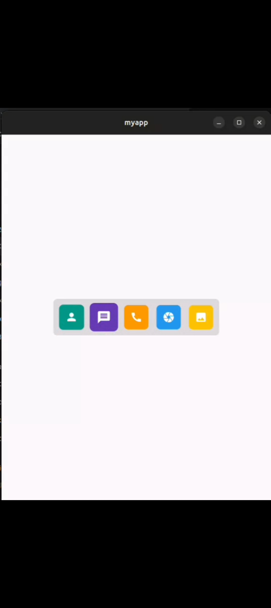
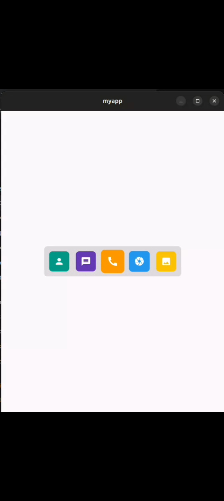
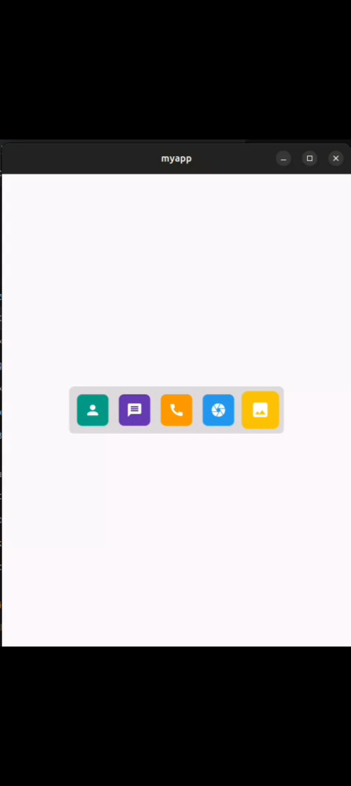
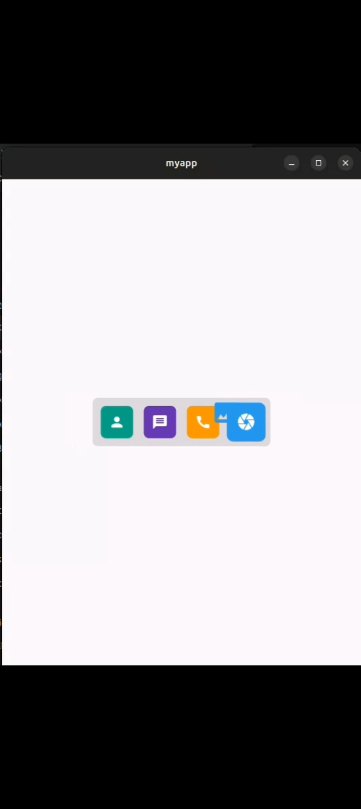
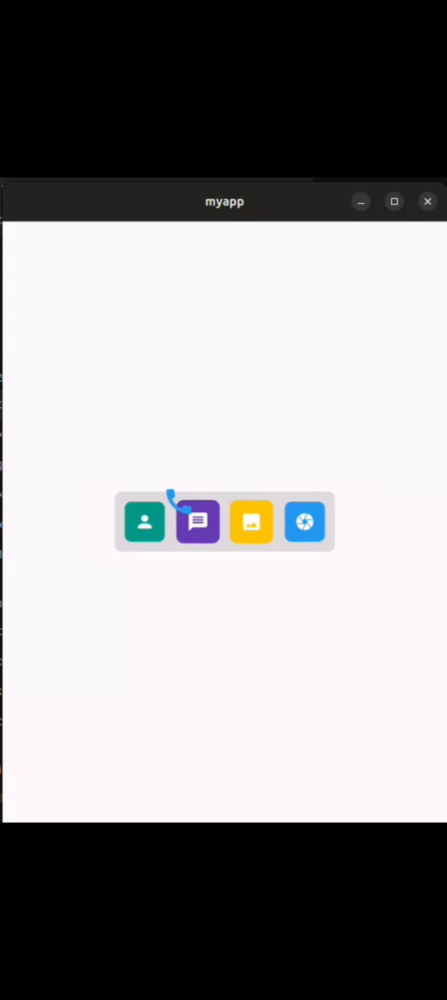
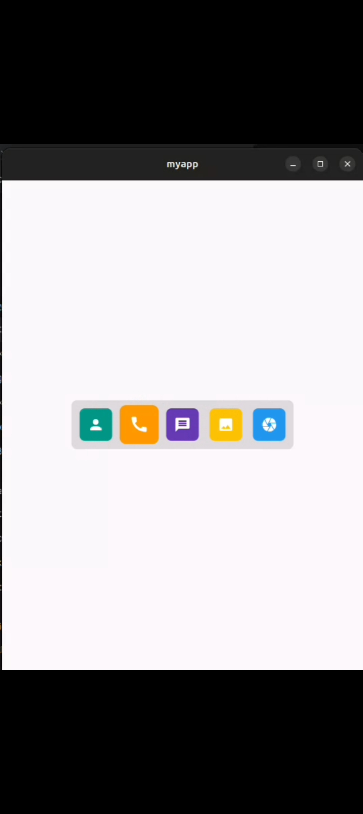
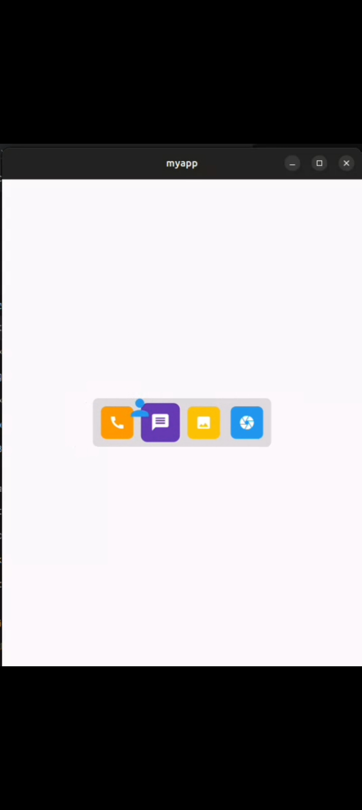

# MyApp - Dock with Draggable Icons

This Flutter application demonstrates a dock with draggable icons. Users can hover over the icons to scale them up and drag them to reorder within the dock. The dock items are displayed as a horizontal row of icons, and each icon has its own dynamic color and hover effect.

## Features
- **Draggable Icons**: Icons are draggable within the dock. Users can rearrange the order of icons by dragging and dropping them.
- **Hover Effect**: Icons scale up when hovered, providing a visual cue to the user.
- **Dynamic Colors**: Each icon's background color is dynamically determined based on its hash code, ensuring a variety of colors.
- **Drag Target**: A `DragTarget` is used to handle dropped items and reorder the icons within the dock.

## Components
### 1. `MyApp`
   - This is the main entry point of the app. It wraps the `Dock` widget inside a `Scaffold` and centers it within the screen.

### 2. `Dock<T>`
   - A custom widget that represents the dock containing draggable items.
   - Accepts a list of items (icons in this case) and a `builder` function that defines how each item is rendered and its hover state.

### 3. `_DockState<T>`
   - The state class for the `Dock` widget, responsible for managing the hover state and handling drag-and-drop actions.
   - Uses `GestureDetector` and `MouseRegion` to detect hover events and a `DragTarget` to allow items to be reordered.

## Setup
To run this application, follow these steps:

1. Clone the repository:
   ```bash
   git clone <repository_url>


## Getting Started

This project is a starting point for a Flutter application.

A few resources to get you started if this is your first Flutter project:

- [Lab: Write your first Flutter app](https://docs.flutter.dev/get-started/codelab)
- [Cookbook: Useful Flutter samples](https://docs.flutter.dev/cookbook)

For help getting started with Flutter development, view the
[online documentation](https://docs.flutter.dev/), which offers tutorials,
samples, guidance on mobile development, and a full API reference.

---

## Video Demo
You can download or view the video directly:
[Download Video](assets/image/2025-01-06.webm)


---

<a></a>
<a></a>
<a></a>
<a></a>
<a></a>
<a></a>
<a></a>

---

## Connect

<a href="https://dev-aryanbhimani.pantheonsite.io/" target="_blank"></a>
<a href="https://www.linkedin.com/in/aryanbhimani/" target="_blank"></a>
<a href="https://twitter.com/yourtwitterhandle" target="_blank"></a> 

For queries or support, feel free to reach out:  
📞 **+91 9408962204**  
📧 **aryan.bhimani.93@email.com**

---